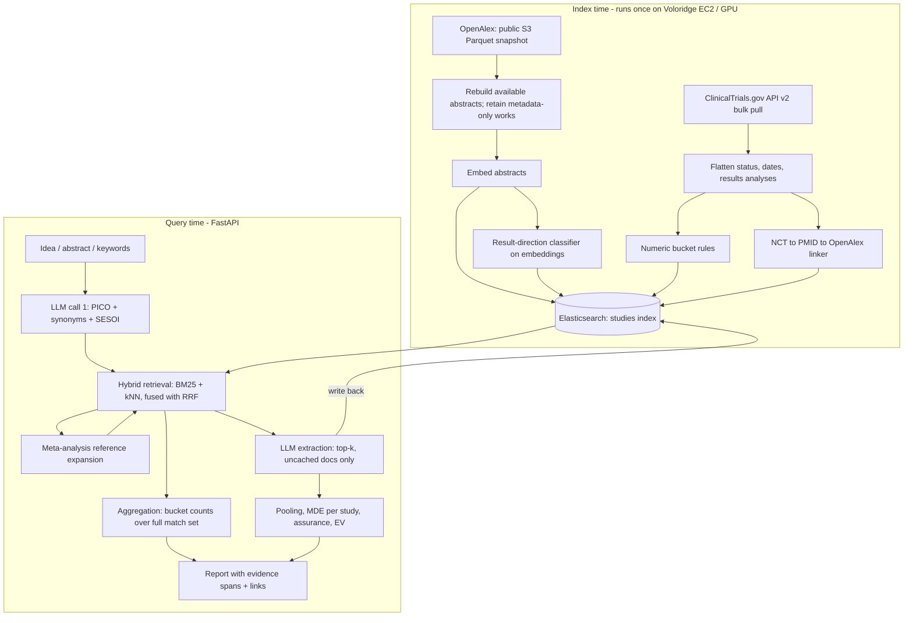

# Null-result search: backend and infrastructure proposal

HackMIT 2026. Written Saturday 3pm; hacking stops Sunday 11am.

## 1. The core idea

Null results are slow to find for three separate reasons, and each needs a different fix:

| Where the null is hiding | Why keyword search misses it | What we do instead |
|---|---|---|
| Inside a published paper, in the abstract's results sentence ("did not differ", "failed to reach") | Search engines index topic, not result direction. You have to open every paper to learn how it came out. | Classify the result direction of every abstract **once, at index time**, and store it as a filterable field. |
| In a trial registry, as posted results that never became a paper | It is not in the literature at all. | Ingest ClinicalTrials.gov results. They are already structured (p-value, estimate, CI), so no LLM is needed to read them. |
| In a trial registry, as a completed or terminated study with nothing posted | There is no text to match. | A pure metadata rule: status, dates, `hasResults`, and no linked publication. |

The efficiency claim, stated plainly: **move the expensive reading from query time to index time.** A naive "AI literature review" sends the top 200 abstracts to an LLM per query. Here, the "2 positive / 1 credible null / 3 inconclusive / 1 failed / 1 unreported" breakdown is an Elasticsearch aggregation over precomputed fields. It returns in milliseconds, covers every matching study rather than the top 50, and costs zero LLM calls. The LLM is only used for (a) parsing the user's idea and (b) pulling numbers out of the handful of top papers nobody has extracted before, and those extractions are written back to the index so they are never paid for twice.

One more retrieval trick does a lot of work: **meta-analysis expansion**. A systematic review on your topic is a hand-curated list of 20 to 60 studies, nulls included, that someone already screened. Find the reviews, read their snapshot-imported `referenced_works` from the index, and re-rank those against the query. This surfaces nulls whose abstracts share no keywords with the user's phrasing.

**Scope recommendation:** build and demo on clinical/biomedical questions. That is where the registry exists, so buckets 4 and 5 of your taxonomy come from hard data rather than LLM judgment. It also puts you squarely in the Regeneron challenge and the Healthcare track. The paper side of the pipeline is domain-agnostic, so say in the pitch that it extends to any field.

## 2. Architecture



Components: one Elasticsearch deployment, one Python API service, one batch box (Voloridge EC2, GPU if available). No other infrastructure. Do not add a separate vector DB, queue, or Postgres; ES holds documents, vectors, and the extraction cache.

## 3. Data sources

### OpenAlex (Voloridge dataset)
- Snapshot: `s3://openalex/data/{jsonl,parquet}/works/updated_date=*/`. Per Voloridge's README the full snapshot is about 750 GB compressed and `works` is about 665 GB. It is partitioned by **update date, not topic**, so there is no way to download "just medicine". Their `fetch.py` refuses anything over 5 GB by default.
- Gotcha: abstracts ship as `abstract_inverted_index` (word to positions). You must rebuild the text. About ten lines of Python; do it in the ingest step.
- Useful fields: `ids.pmid`, `referenced_works`, `type`, `is_retracted`, `topics`, `cited_by_count`, `publication_year`.

**Implementation amendment, 2026-09-19:** the public S3 snapshot is the sole OpenAlex ingestion source. The API seed and singleton lookup paths have been removed. No OpenAlex API key or AWS credentials are required. The default scope is hypertension **or** kidney research, across all years and work types, retaining metadata-only records when abstracts are absent.

Run a manifest-only plan, then scan Parquet on the remote batch host using DuckDB column projection and the versioned topic/text rules. Checkpoints pin the release, scope and committed byte offsets. Partial runs never claim complete snapshot coverage. Matched rows are normalized, classified, embedded and linked into Elasticsearch in bounded batches. Query-time reference expansion uses indexed references only; a separate S3 pass can backfill missing work IDs. See the [ingestion guide](../backend/app/ingest/README.md) for commands and exact coverage semantics.

The checked manifest contains 2,446 works parts totaling 724,970,323,127 physical bytes, dated 2026-06-26. Abstract indexes are JSON strings in the inspected Parquet schema. The snapshot contains metadata and available abstracts, not full-text papers. A full scan has not been launched.

### ClinicalTrials.gov API v2
No key. `GET https://clinicaltrials.gov/api/v2/studies` with `pageSize=1000` and page tokens. For the hypertension/kidney corpus, exhaust the condition-union query across all statuses, study types and dates. Reporting-gap analysis applies its own eligibility rules after ingestion. Fields to keep:

- `protocolSection.statusModule`: `overallStatus`, `whyStopped`, `primaryCompletionDateStruct`
- `protocolSection.designModule.enrollmentInfo` (count, ACTUAL vs ESTIMATED)
- `protocolSection.armsInterventionsModule`, `conditionsModule`, `outcomesModule` (this is your PICO, already structured)
- `protocolSection.referencesModule.references[]` with `pmid` and `type` (RESULT vs BACKGROUND)
- `hasResults`
- `resultsSection.outcomeMeasuresModule.outcomeMeasures[].analyses[]`: `pValue`, `paramType`, `paramValue`, `ciLowerLimit`, `ciUpperLimit`, `statisticalMethod`

Verify these paths against one real record before writing the flattener. AACT (the CTTI flat-file dump of the same registry) is a fallback if the API pull is slow.

### Labeled data for the classifier
Look at the EvidenceInference dataset (Lehman et al. 2019, v2 DeYoung et al. 2020): RCT articles annotated per intervention/comparator/outcome as significantly increased, significantly decreased, or no significant difference. If it is as I remember, that is free training and evaluation data for exactly this task. Confirm availability before counting on it. The fallback in section 4 does not need it.

## 4. Index-time pipeline

1. **Rebuild and normalize** available abstracts; retain and mark works without one.
2. **Embed** every abstract with a small open model on the GPU box (a MiniLM or BGE-small class model does millions of abstracts in well under an hour on one modern GPU). Use the same model for queries at serve time. Do not use an embeddings API for the bulk pass: rate limits will eat your night, and batch endpoints have 24-hour turnaround.
3. **Result-direction classifier.** Labels: `positive`, `null`, `mixed`, `no_result_stated` (protocols, reviews, methods papers).
   - Weak labels from a phrase lexicon: "no significant difference", "did not differ", "not superior", "failed to", "did not reach", "futility", "no evidence of" versus "significantly improved/reduced", "superior to".
   - 3,000 to 5,000 abstracts labeled by a small OpenAI model with structured output. A couple of dollars.
   - Train logistic regression or a small MLP **on the embeddings you already computed**. Minutes to train, no second GPU pass, and scoring the whole corpus is a matrix multiply.
   - Store `result_label`, `null_score` (probability), and the sentence that triggered it (`evidence_span`), so every claim in the UI can be checked by a human in five seconds.
4. **Registry flattener.** One row per trial, with the primary outcome's analysis numbers when posted.
5. **Linker.** `references[].pmid` to OpenAlex `ids.pmid`. Second pass: regex `NCT\d{8}` in abstracts. A trial with a linked RESULT publication is "reported"; merge the two records so the paper and the registry entry count once.
6. **Bulk index** to Elasticsearch.

Side product worth one slide: where a trial's registry primary outcome is null but the linked paper's abstract is classified positive, that is abstract "spin". You can report a corpus-wide spin rate. That is a genuine finding from the data, which is what Voloridge's "Insight" criterion asks for.

## 5. Elasticsearch design

One index, `studies`, holding both papers and trials.

| Field | Type | Notes |
|---|---|---|
| `source` | keyword | `openalex`, `ctgov`, `merged` |
| `title`, `abstract` | text | BM25, with a biomedical synonym filter if time allows |
| `population`, `intervention`, `comparator`, `outcome` | text | From registry directly; for papers, filled lazily by extraction |
| `embedding` | dense_vector | Quantized HNSW (the default int8 option) keeps RAM manageable |
| `result_label`, `bucket` | keyword | Precomputed; `bucket` is the five-way taxonomy |
| `null_score` | float | Classifier probability |
| `evidence_span` | text, not indexed | For display |
| `n`, `estimate`, `ci_low`, `ci_high`, `p_value`, `effect_type` | numeric / keyword | From registry, or written back after extraction |
| `overall_status`, `why_stopped`, `has_results`, `primary_completion_date`, `enrollment_actual`, `enrollment_planned` | mixed | Registry only |
| `pmids`, `nct_ids`, `referenced_works` | keyword | Linking and expansion |
| `is_retracted`, `is_review`, `year`, `cited_by_count` | mixed | |
| `extracted_at` | date | Presence means the LLM extraction is cached |

Query shape (check exact syntax against your cluster version):

```json
POST studies/_search
{
  "retriever": { "rrf": {
    "rank_window_size": 200,
    "retrievers": [
      { "standard": { "query": { "bool": {
          "must":   { "multi_match": { "query": "<PICO terms + synonyms>",
                       "fields": ["title^2", "abstract", "intervention^2", "outcome^2"] } },
          "should": { "match": { "abstract": { "query": "no significant difference did not differ futility failed", "boost": 0.5 } } }
      } } } },
      { "knn": { "field": "embedding", "query_vector": [], "k": 200, "num_candidates": 1000 } }
    ]
  } },
  "size": 50
}
```

- Run the **bucket counts as a second, cheap query**: same filters, `size: 0`, `terms` aggregation on `bucket`, plus a `date_histogram` on year. That way the headline numbers cover the full matching set, not just the page of hits.
- Add a `significant_text` aggregation on `abstract` restricted to `bucket: credible_null`. It returns terms over-represented in the nulls relative to the rest of the matches, which tells the user *which outcomes or populations keep coming up empty*. This is an Elastic-native feature that answers a question an LLM would need to read everything to answer.
- `semantic_text` with Elastic's hosted inference is the low-effort route if your slice is small (under roughly 100k docs). For millions of docs, self-embed and use `dense_vector`; inference throughput on a trial cluster will not keep up.

## 6. Query-time pipeline

1. **Parse** (one small-model call, structured output): population, intervention, comparator, outcome, synonyms and drug/brand aliases, study designs of interest, and a proposed smallest effect size of interest (SESOI) with its rationale. The user can override the SESOI; show it prominently because bucket assignment depends on it.
2. **Retrieve**: hybrid query above, top 200.
3. **Expand**: among hits where `is_review` is true or the title matches "meta-analysis" / "systematic review", take the top 3, fetch their `referenced_works` (already in the index, or free singleton lookups), score against the query vector, and merge anything above threshold.
4. **Registry sweep**: separate structured query on `intervention` + `outcome`/`condition` with `source: ctgov`. This is what fills buckets 4 and 5.
5. **Extract**: for the top 30 to 40 paper hits without `extracted_at`, one structured-output call each (parallel): design, N per arm, primary outcome, effect type, estimate, CI, p, whether the primary outcome was met, and the verbatim sentence supporting each number. Reject any extraction whose quoted sentence is not a substring of the abstract. Write back to ES.
6. **Bucket, pool, score** (section 7 and 8). Pure Python, no LLM.
7. **Narrate**: one final call that receives only the structured table and writes the summary and alternative routes. It never sees raw abstracts, so it cannot invent studies.

## 7. Bucket rules

Let δ be the SESOI on the study's effect scale, and CI the 95% interval.

| Bucket | Rule |
|---|---|
| Meaningful effect | CI excludes zero and the point estimate is at least δ. If CI excludes zero but sits entirely inside ±δ, tag "significant but trivial". |
| Credible evidence of no meaningful effect | CI lies entirely inside (−δ, +δ). This is equivalence-test logic, and it is what separates a real null from an underpowered one. |
| Inconclusive | CI includes zero and also extends beyond ±δ. |
| Failed for methodological reasons | Registry status TERMINATED, WITHDRAWN, or SUSPENDED (show `whyStopped`); actual enrollment under half of planned; `is_retracted`; or extraction flags no control arm. |
| Completed, never reported | Status COMPLETED, primary completion more than 12 months ago, `hasResults` false, no linked RESULT publication, no paper mentioning the NCT ID. |

When a study has only a p-value and N, back out an approximate standard error and mark the row "reconstructed". When it has nothing numeric, fall back to the classifier label and mark it "text only". Show these tiers in the UI. Judges from a quant fund and a biostatistics group will ask.

## 8. Statistics and EV of pursuit

- **Per-study minimum detectable effect:** MDE ≈ 2.8 × SE (80% power, two-sided 5%). Display it next to every null. "This null could only have detected an effect of 0.6 or larger" is the single most useful sentence the tool can produce.
- **Pooled estimate:** random-effects meta-analysis (DerSimonian-Laird; `statsmodels.stats.meta_analysis.combine_effects`) when at least 3 studies share an effect type. Report μ, its SE, and τ². Below 3, do not pool; say so.
- **File drawer, measured rather than inferred:** the share of registered, completed trials on this question with no results anywhere. With fewer than 10 studies, funnel-plot tests are unreliable, so use the registry ratio instead and state it as a caveat on the pooled estimate.
- **Assurance (Bayesian expected power):** draw θ from N(μ, τ² + SE_μ²); for each draw compute the power of the user's planned study (their N, α) to detect θ; average. This is the probability their study succeeds given everything found. Twenty lines of NumPy.
- **EV of pursuit** = assurance × V_success + (1 − assurance) × V_null − cost. User supplies the three values, or picks a preset. V_null is not zero: a well-powered null is publishable and informative, and the tool can say whether their design would land in bucket 2 or bucket 3 if it comes up empty.
- **Also output:** N required for 80% assurance, and alternative routes ranked by where the evidence is thinnest (populations, doses, or outcomes that the `significant_text` and PICO fields show are untested, versus the ones that are saturated with nulls).

## 9. LLM cost design (The Token Company challenge)

| Lever | Effect |
|---|---|
| Result direction classified at index time by a linear model on embeddings | Breakdown counts cost zero LLM calls per query |
| Registry results parsed from structured JSON | Zero LLM calls for trial numbers |
| Extraction written back to ES, keyed by work ID | Each paper is read by an LLM at most once, ever; popular topics approach zero marginal cost |
| Cascade: small model for parse and extraction, large model only for final narration over a compact table | Large model sees a few hundred tokens, not 40 abstracts |
| Static system prompt and schema first, abstract last | Provider-side prompt caching applies to the prefix |
| The Token Company's compression models on abstracts before extraction | Measure tokens and extraction accuracy with and without; keep it only if accuracy holds |

Instrument every call (tokens, dollars, latency) from the first commit. The slide is: cost per query for "LLM reads the top 200 abstracts" versus this pipeline cold versus this pipeline warm.

## 10. Sponsor map

| Sponsor | Fit | What to show them |
|---|---|---|
| **Voloridge** | Primary. OpenAlex is on their list; their compute runs the batch jobs. | Snapshot-scale ingest, the classifier with measured precision/recall, the spin-rate and file-drawer findings. Go to their booth now for an EC2 instance. |
| **Elastic** | Primary. Their prompt is "find the signal" in messy data. | Hybrid RRF retrieval, aggregations as the answer, `significant_text` on the null subset, ES as extraction cache. |
| **Regeneron** | Primary if you scope to trials. They want tools that help plan trials. | Assurance and sample-size output, registry sweep. Required packaging: MIT license, public GitHub, demo video, 10 to 12 slides. Read their starter kit at regn.link/hackmit and ask mentors in #regeneron which pain point this matches. |
| **OpenAI** | Primary. | Structured-output extraction and parsing via the API. You must show one concrete Codex contribution: have Codex write the registry flattener plus tests against 20 hand-checked trials, and keep the before/after. Credits only go to teams submitting to their challenge. |
| **The Token Company** | Strong secondary; section 9 is the submission. | The three-way cost comparison. |
| **Ramp** | Free secondary. "Saves time and money" is the whole pitch. | Hours of literature review and the cost of a doomed study avoided. |
| **Long Lake** | Moderate. The skeptic is a PI who assumes AI invents citations. | Every number links to a verbatim span and a DOI or NCT ID; the narrator never sees free text. |
| **Runpod** | Challenge still TBA. | If it involves GPU credits, run the embedding pass there. |
| **Cognition (Devin)** | Optional. | Only if you would rather hand the ingest pipelines to Devin than Codex. Pick one to feature. |
| HackMIT track | Healthcare | |

Skip: Meta, Visa, Dropbox, GiveCampus, Maximor, Arrowstreet, Deepgram, ElevenLabs, SpaceXAI, hardware challenges. I could not find a limit on how many sponsor challenges one project may enter; check Plume.

## 11. Build order against the clock

| When | What |
|---|---|
| Now to 4pm | Voloridge compute/storage, Elastic deployment and OpenAI credits. Inspect the public S3 manifest; start the scoped registry pull and budgeted snapshot scan on the batch host. |
| 4 to 7pm | Abstract rebuild, ES mapping, bulk index with BM25 only. Registry flattener (Codex). FastAPI endpoint returning raw hits. End-to-end skeleton working before dinner. |
| 7 to 10pm | Embeddings, kNN + RRF. Weak labels, LLM labels, train classifier, write `result_label` back. Bucket rules for registry rows. |
| 10pm to 1am | Extraction with write-back, stats module, linker. Launch the overnight DuckDB snapshot scan. **Create the Plume project before midnight or you cannot be judged.** |
| 7 to 10am | Index overnight output. Hand-check 50 classifier outputs and 20 extractions; compute precision/recall and the cost table. Record the demo video. Slides. |
| 10am | Freeze. Submit on Plume by 11am. |

Demo queries: pick questions with well-known large nulls so judges can verify the tool is right, for example vitamin D supplementation for depression, omega-3 for cognitive decline, and arthroscopic surgery for knee osteoarthritis. Pre-warm the cache for them, and run one cold query live to show honest latency.

## 12. Risks

- **Abstract spin** biases the classifier toward "positive". Mitigate by preferring registry primary-outcome numbers whenever a link exists, and report the disagreement rate.
- **Effect scales differ** (SMD, odds ratio, hazard ratio, mean difference). Only pool within one type; convert log-OR to SMD if needed; otherwise present per-study rows without pooling.
- **SESOI is a judgment call.** Make it a visible, editable input, not a hidden constant.
- **Snapshot scan fails.** Retain checkpoints and a clearly labelled, verified partial demo corpus. Resume the full scan on the batch host; do not describe a partial run as complete.
- **Registry coverage** is US-centric and clinical. Say so. Outside medicine the tool still gives buckets 1 to 3 from papers, without 4 and 5.

## Sources

- Voloridge challenge materials and OpenAlex fetch README: https://voloridge-hack-mit-2026.s3.us-east-1.amazonaws.com/index.html
- OpenAlex public snapshot access: https://help.openalex.org/access/snapshot/
- ClinicalTrials.gov results field paths (as listed in ClinicalTrialsHub, arXiv 2512.08193): https://arxiv.org/pdf/2512.08193
- AACT description: https://arxiv.org/pdf/1907.00185
