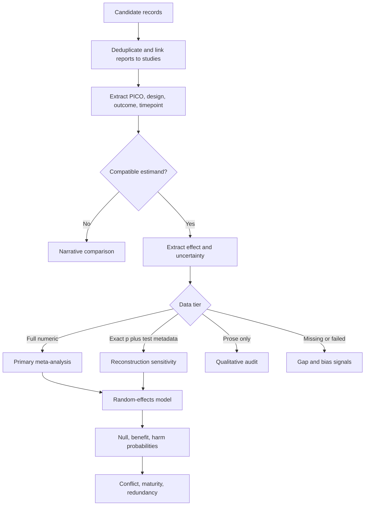

# Evidence redundancy: Python statistical workflow

This project turns the attached concept into an auditable workflow for asking:

> Has a sufficiently similar biomedical question already been answered, or is uncertainty caused by sparse evidence, conflicting evidence, or missing reporting?

It is a decision-support prototype, not a clinical decision system. Every pooled result requires a domain expert to approve the estimand, PICO compatibility, effect scale, timepoint, and smallest effect size of interest (SESOI/MCID).

## The central design

The numeric effect and uncertainty are the primary representation. Labels are only summaries. The pipeline never converts prose, a thresholded p-value, citations, or an LLM confidence score into fake precision.



## Statistical policy

### P-values

- Store exact reported p-values unchanged.
- `alpha=0.05` is a configurable reporting convention, not a measure of effect size or scientific importance.
- Reconstruct an effect only when the exact p-value, test family, sidedness, direction, and needed degrees of freedom/sample sizes are known.
- Treat `p<0.05`, `p>0.10`, and “NS” as censored statements. Do not substitute 0.049, 0.5, or any midpoint.
- Put reconstructed effects in a sensitivity analysis, never the primary analysis.
- Handle multiplicity upstream by identifying the prespecified primary outcome and analysis. If exploring many hypotheses, add an FDR procedure, but do not rewrite the paper's p-values.

### Equivalence and accepted medical cutoffs

There is no universal medical SESOI. The hierarchy is:

1. A prespecified patient-important MCID for the exact outcome and population.
2. A regulatory or specialty-specific margin for the exact estimand.
3. A justified standardized-effect sensitivity range, explicitly labeled generic.

The included `[-0.2, 0.2]` default is only a runnable standardized-effect example. FDA-style 80–125% limits belong to pharmacokinetic bioequivalence on the ratio/log scale; they are not a general clinical-null rule.

At one-sided alpha 0.05, TOST equivalence corresponds to a 90% two-sided confidence interval. The original attachment used a 95% interval, which is conservative but not the standard TOST equivalence rule.

### Pooling

- Pool only one prespecified effect per study per compatible cluster.
- Require identical outcome construct, effect measure, scale, timepoint, and direction. PICO embeddings can propose clusters but cannot approve pooling.
- Use a random-effects model with REML heterogeneity and Hartung–Knapp uncertainty when at least three studies are available.
- Report tau-squared, I-squared, Q, and—when at least three studies exist—a prediction interval.
- Do not convert odds ratios, hazard ratios, correlations, and standardized mean differences merely to force a pool. Keep separate clusters unless the conversion is scientifically defensible.
- For multiple dependent effects from one study, select the primary estimand or add multilevel/robust-variance meta-analysis before production.

### Bias and citations

Citation count is not evidence strength. It can rank discovery results or expose overlooked work, but it must never enter the meta-analytic weight or redundancy score.

Risk of bias is also not safely represented by an arbitrary coefficient. The primary workflow excludes `high` risk records from pooling and shows counts. Production analyses should report prespecified sensitivity runs: all eligible studies; low/some-concerns only; preregistered only; and published versus registry/unpublished evidence. If conclusions move, the answer is fragile.

## Redundancy score

For a compatible cluster, the random-effects predictive distribution is divided into three clinically interpretable zones:

- harm: effect below the lower SESOI;
- clinically negligible: effect inside the SESOI;
- benefit: effect above the upper SESOI.

The workflow computes all three probabilities. It then calculates:

`resolution = 1 - entropy(P_harm, P_null, P_benefit) / log(3)`

This avoids the error in the attachment's `max(p_within, p_below + p_above)`: 50% harm plus 50% benefit is conflict, not resolution.

Evidence maturity compares accumulated inverse-variance information with the precision needed for a target confidence-interval width relative to the SESOI. The displayed score is:

`redundancy = 100 × predictive-zone resolution × evidence maturity`

Never show it without its components. A high score means the same PICO/estimand is predictively concentrated in one clinical zone; it does not mean a new population, safety endpoint, mechanism, or implementation study lacks value.

The status distinguishes:

- `resolved_clinically_negligible`, `resolved_benefit`, or `resolved_harm`;
- `conflicting_evidence` when heterogeneity or the prediction interval spans important harm and benefit;
- `sparse_or_imprecise` when information is inadequate;
- `insufficient_numeric_evidence` or `not_poolable` when a number would be misleading.

## Data tiers

| Tier | Minimum usable evidence | Role |
|---|---|---|
| Full numeric | Effect plus SE, variance, or CI | Primary quantitative synthesis |
| Reconstructed | Exact p-value plus full test metadata | Sensitivity analysis only |
| Qualitative | Constrained finding label plus source text | Counts and narrative audit only |
| Unextractable | No usable result | Manual-review queue |
| Failed | Enrollment/protocol/method failure | Feasibility signal, not an outcome |
| Completed unreported | Completion known, result absent | Reporting-bias and research-gap signal |

The constrained qualitative labels are `benefit`, `harm`, `null_credible`, `null_underpowered`, `mixed`, `methodologically_failed`, and `unclear`. Validate any NLP model against dual human annotation; retain the exact source span and adjudication trail.

## Installation and run

```bash
python -m venv .venv
. .venv/bin/activate
pip install -e .
PYTHONPATH=src python -m unittest discover -s tests -v
evidence-workflow examples/studies.csv --sesoi-low -0.2 --sesoi-high 0.2 --output-dir output
```

Outputs:

- `report.json`: complete configuration, cluster results, guardrails, and study audit;
- `study_audit.csv`: one row per extracted study;
- `cluster_summary.json`: compact cluster-level results.

## Production workflow

1. Register the hypothesis and estimand: PICO, design, outcome, timepoint, effect scale, direction, SESOI, primary analysis, and planned sensitivity analyses.
2. Search multiple sources, including registries and grey literature. Deduplicate reports and link multiple papers to the same underlying study.
3. Use structured extraction with provenance: page/table/sentence, extractor, timestamp, and reviewer status. Dual-review a validation sample.
4. Gate PICO compatibility with hard fields first; use embeddings only to retrieve near matches and proposed subgroups.
5. Normalize effect direction and scale. Keep unsupported conversions separate.
6. Run the primary numeric synthesis, reconstructed-p sensitivity, bias sensitivities, and leave-one-out diagnostics.
7. Diagnose reporting bias only when appropriate; funnel asymmetry tests are unreliable with very few studies.
8. Produce a landscape: resolved clusters, conflicting clusters, sparse clusters, failed attempts, unreported completions, and nearby PICO opportunities.
9. Validate extraction, qualitative classification, cluster assignment, and final statistical decisions separately. Report per-class precision/recall, calibration where probabilities are emitted, inter-rater agreement, and an error audit—not only overall accuracy.

## What to add next

- adapters for binary events (log risk ratio/log odds ratio), continuous outcomes (mean difference/Hedges g), survival outcomes (log hazard ratio), and correlations;
- registry/publication linkage and retraction/correction checks;
- multilevel or robust-variance meta-analysis for dependent effects;
- small-study/publication-bias sensitivity and selection models;
- expected-value-of-sample-information analysis for a proposed new study;
- a reviewed MCID registry with provenance and versioning;
- extraction schemas with page-level citations and human adjudication.

## Interpretation answers to the original questions

- **Should citations affect strength?** No. Use them for retrieval coverage and an “overlooked evidence” view only.
- **Discrete or continuous strength?** Continuous estimates and probabilities for computation; discrete labels only for display and qualitative-only records.
- **Accepted medical cutoffs?** Keep alpha configurable; use a domain-approved MCID/SESOI. There is no general medical equivalence cutoff.
- **Bias coefficients?** Not in the primary model. Use transparent exclusion and sensitivity analyses; a bias-adjusted model can be added only with a justified, validated prior.
- **Positive and negative separately?** Yes: retain direction and report benefit, harm, and clinically negligible probabilities separately. Never collapse benefit and harm into one “real effect” bucket.
- **Bayesian 50/50 prior?** Do not use a Beta-Binomial update on study labels. Study results are not Bernoulli votes. If a Bayesian model is added, place a scientifically justified prior on the effect and heterogeneity, then report posterior zone probabilities and prior sensitivity.

## Core references

- [American Statistical Association statement on p-values](https://www.amstat.org/asa/files/pdfs/p-valuestatement.pdf)
- [FDA: Statistical Approaches to Establishing Bioequivalence](https://www.fda.gov/regulatory-information/search-fda-guidance-documents/statistical-approaches-establishing-bioequivalence)
- [statsmodels meta-analysis documentation](https://www.statsmodels.org/devel/examples/notebooks/generated/metaanalysis1.html)
- [Cochrane Handbook](https://training.cochrane.org/handbook/current)
